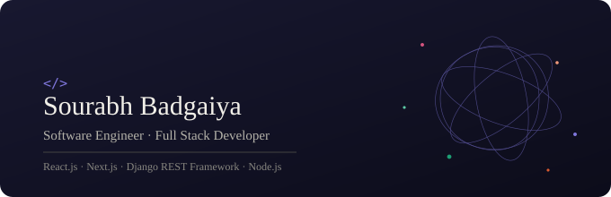

  

<h1 align="center">Hey, I'm Sourabh 👋</h1>
<h3 align="center">Software Engineer • Full Stack Developer • Bhopal, India</h3>

  

---

### 🚀 About Me

- 💻 Full Stack Developer at **Kaizen Young Consultants**, also building frontend for **AgenQ** (an AI product assistant platform for a Canada-based client)
- 🏗️ Shipped 5+ production modules serving 1000+ daily users, with CI/CD pipelines via GitHub Actions and deployments to Azure App Service
- 🎓 Former Full Stack Web TA at **Sheriyans Coding School**, mentoring students on the MERN stack
- 🎨 Side quest: creating **Three.js / React Three Fiber** interactive demos and content
- 🎯 MCA graduate, open to full-stack / MERN roles across India

---

### 💼 Experience

| Role | Company | Duration |
|---|---|---|
| Full Stack Developer | Kaizen Young Consultants | Nov 2025 — Present |
| Frontend Developer (AgenQ) | AI Product Assistant Platform, via Kaizen | Nov 2025 — Present |
| Full Stack Web TA | Sheriyans Coding School | Jan 2025 — Mar 2025 |

---

### 🏗️ Projects

**Coaching Classes Platform** — Full-Stack SaaS
Role-based (Admin/Student) platform with Django REST Framework + Next.js — enrollment, payments, attendance, live classes, auto-graded tests. JWT auth, payment-gated access, Celery + Redis for automated reminders. Dockerized and deployed to Azure App Service with GitHub Actions CI/CD.

**Fundeable** — AI Fundraising OS
Full-stack ownership of a platform connecting founders and investors — deal flow tools, AI agent integrations, community/event features. REST APIs + MongoDB schema designed for scalable multi-role data.

**Tacoza** — Restaurant Management SaaS
Responsive web app built with Next.js + Django REST Framework. REST APIs for orders, menu, subscriptions, users, and inventory using PostgreSQL.

---

### 🎬 Featured Interactive Builds

> Screen-recorded demos from my Three.js content series — click to view code

| Demo | Tech | Description |
|---|---|---|
| 🌀 Rasengan Particle Swirl | R3F + Drei | Swirling particle system with additive blending |
| 🧲 Draggable TorusKnot | React Three Fiber | Momentum-based physics drag interaction |
| 🎞️ Scroll Video Scrubber | Three.js | Scroll-driven frame-by-frame video canvas |
| 🔄 360° Turntable Viewer | Three.js | Drag-to-spin product viewer |
| ✨ Particle Text Formation | React + Three.js | Text assembling from animated particles |

<!-- 
  Add real repo links/gifs here once pushed, e.g.:
  
-->

---

### 🛠️ Tech Stack

  

**Languages:** Python · JavaScript · TypeScript · SQL
**Frontend:** React.js · Next.js · Redux Toolkit · Tailwind CSS
**Backend:** Django · Django REST Framework · Node.js · Express.js
**Database:** PostgreSQL · MongoDB · Redis
**Cloud/DevOps:** Azure App Service · Docker · Celery · GitHub Actions (CI/CD)
**Tools:** Git · Postman · Playwright

---

### 📊 GitHub Stats

  
  

  

---

### 📫 Connect With Me

  
  

<i>⭐️ From <a href="https://github.com/sourabhbadgaiya2">Sourabh</a> — building things that move.</i>

